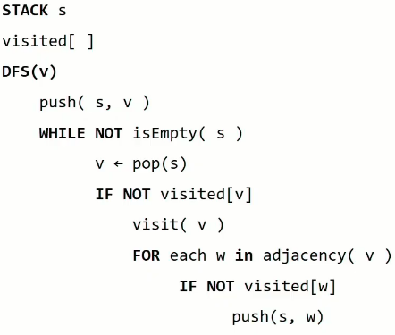
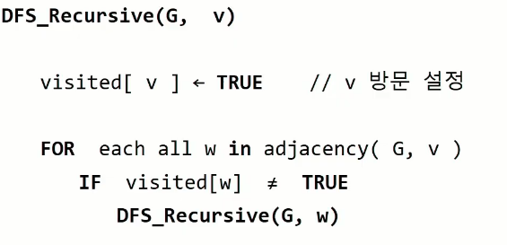

# [SWEA] 1219. 길찾기

> https://swexpertacademy.com/main/code/problem/problemDetail.do?contestProbId=AV14geLqABQCFAYD

### 💻구현 코드1

```python
def dfs(now):
    for next in range(n):
        if Map[now][next] == 0:
            continue
        if visited[next] == 1:
            continue
        visited[next] = 1
        dfs(next)
for test_ in range(1, 11):
    t, n = map(int, input().split())
    lis = list(map(int, input().split()))
    Map = [[0] * n for _ in range(n)]
    visited = [0] * n
    for i in range(0, len(lis), 2):
        if lis[i+1] == 99:
            lis[i+1] = n-1
        Map[lis[i]][lis[i+1]] = 1
    dfs(0)
    print('#{} {}'.format(test_, visited[-1]))
```

- `visited`리스트를 만들어 중복해서 방문하지 않게 방지해준다.

### 💻구현 코드2

```python
def dfs(now):
    for next in range(n):
        if Map[now][next] == 1:
            if next == n-1:
                return 1
            Map[now][next] = 0
            a = dfs(next)
            if a == 1:
                return 1
    return 0
for test_ in range(1, 11):
    t, n = map(int, input().split())
    lis = list(map(int, input().split()))
    Map = [[0] * n for _ in range(n)]
    for i in range(0, len(lis), 2):
        if lis[i+1] == 99:
            lis[i+1] = n-1
        Map[lis[i]][lis[i+1]] = 1
    print('#{} {}'.format(test_, dfs(0)))
```

- 지나온 간선에 대해 간선을 나타내는 2차원 리스트 `Map`의 값을 1에서 0으로 바꿔줌으로써 이미 지나온 경로로 가는 것을 방지해줌

- 이 문제에서는 상관없지만 다른 문제에서는 간선리스트를 수정하는 것이 문제가 될 수도있음 **(주의)**

  

### 🧐다른풀이

- 리스트 표시 방법
  - 100개의 길이를 갖는 두개의 리스트를 만들어 간선 표시
  - 인접행렬 만들기
  - 인접리스트 만들기
    - 100개의 길이를 갖고 각 인덱스(출발점)의 리스트안에 갈 수있는 정점(도착점)을 표기
  - 인접행렬과 인접리스트는 각각의 장단점이 있다.
- 반복문을 이용한 DFS 수도코드
  - 

- 재귀를 이용한 DFS 수도코드

  - 

  >도착점에 도착했을 때 그 값을 가지고 무수히많은 재귀함수들을 뚫고 나오는 건 가능하지만 힘든일이다. 해결책으로는 글로벌 변수를 이용해 도착했다는 것을 알리는 것이있다.

