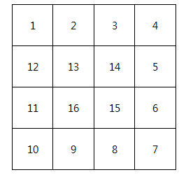

# [SWEA] 1954. 달팽이 숫자

> https://swexpertacademy.com/main/code/problem/problemDetail.do?contestProbId=AV5PobmqAPoDFAUq

### 💻구현 코드1

```python
tc = int(input())
for test_ in range(1, tc + 1):
    n = int(input())
    dx = [1, 0, -1, 0]
    dy = [0, 1, 0, -1]
    direc = 0
    now = [1, 1]
    lis = [[-1 if i == 0 or ii == 0 or i == n+1 or ii == n+1 else 0 for i in range(n+2)] for ii in range(n+2)]
    for i in range(1, n**2+1):
        if lis[now[1]+dy[direc]][now[0]+dx[direc]] != 0:
            direc = (direc+1) % 4
        lis[now[1]][now[0]] = i
        now[0] += dx[direc]
        now[1] += dy[direc]
    print('#{} '.format(test_))
    for i in range(1, n+1):
        for ii in range(1, n + 1):
            print(lis[i][ii], end=' ')
        print()
```

### 👍배운점

- 2차배열에서 상하좌우 방향으로 이동하는 방법

### 🧐다른풀이

- 
- 좌방향 -> 아래방향 -> 우방향 -> 위쪽방향 으로 이동할때 마다 줄어드는 거리의 규칙을 찾아서 풀수도 있다.
  - (-1,0)에서 시작